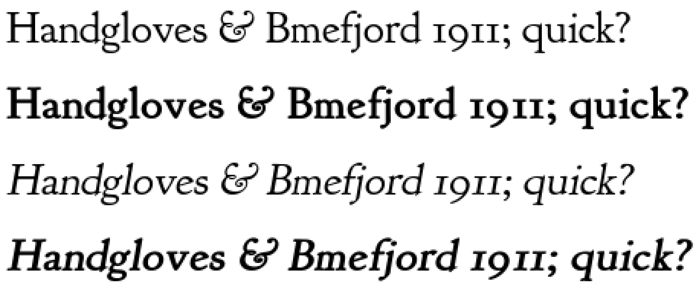
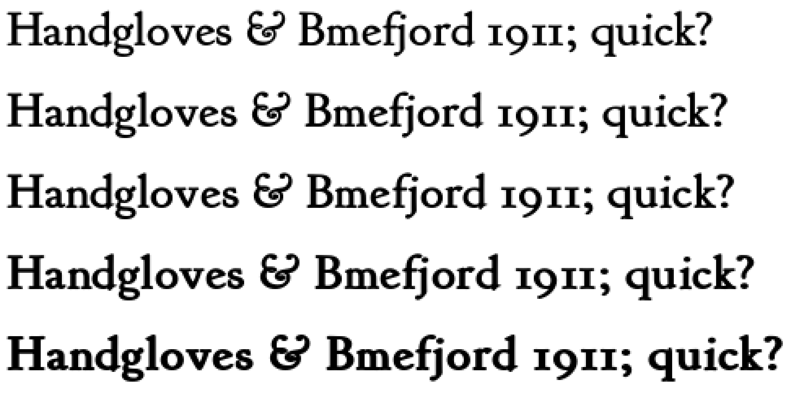

# Synthetic bold and bold-italic for regular-only families

Plan for giving **CalendoniaCC** and **GoudyBookletter1911** usable bold and
bold-italic (and italic, where none exists) at `.cpfont` build time. Status:
researched and prototyped; implementation not started.

## Why

`EpdFontFamily` falls back to regular for any style a family doesn't ship, so
in a regular-only family every `<b>` and `<i>` in a book renders as plain
roman — emphasis silently disappears. Both target families are regular-only on
the card. The fix belongs at **build time** (a synthesized style baked into the
`.cpfont`), not render time: KOReader's render-time global embolden is known to
double-bolden text that is *already* bold (koreader/koreader#12525), a failure
mode a per-style build step cannot have.

## What the two families actually are

**GoudyBookletter1911** — Barry Schwartz's revival of Frederic Goudy's
*Kennerley Old Style* (1911), public-domain/OFL, upstream ships **regular
only**. The historical family did grow real companions — italic in 1918,
bold and bold italic in 1924 (Lanston Monotype) — so a bold is not an
invention, just unavailable: the only complete digitization (LTC Kennerley,
P22/Lanston) is commercial. Kennerley is a low-contrast Venetian old-style
that fits tightly; that low contrast is good news for outline emboldening,
which thickens hairlines by the same amount as stems and therefore hurts
high-contrast faces most. Schwartz's own *Sorts Mill Goudy* (OFL, roman +
italic) is the closest open reference for what a Goudy italic's slant and
rhythm should feel like: measure its `post.italicAngle` before picking ours.

**CalendoniaCC** — identified (owner confirmed): **Caledonia CC**, Carter &
Cone's 2026 rendition by Matthew Carter of W.A. Dwiggins's *Caledonia* (1938),
a transitional Scotch Roman with vertical stress and much higher stroke
contrast than Kennerley. The foundry ships **Regular and Italic only**, in
four optical sizes — **no Bold or Bold Italic exists in the family at all**
(carterandcone.com/font/caledonia/), so synthesis is genuinely the only path
to a bold, not a workaround for an unpurchased style. Two consequences:

- **The italic is real.** Nothing is ever sheared for this family: synthesize
  bold by emboldening the Regular and bold-italic by emboldening the Italic.
  The `slant_deg` machinery below is Goudy-only.
- **Commercial license.** Synthesis output stays on the user's own card, never
  in a distributed font pack. Use the Text optical size as the source.
- **High contrast is the risk.** Outline emboldening adds the same absolute
  weight to hairlines as to stems, so Caledonia's thins fatten
  proportionally more than Kennerley's. Start from a smaller `embolden_em`
  than Goudy's and judge the hairline/stem relationship at 12 pt first.

## Measured facts the parameters hang on

The converter (`lib/EpdFont/scripts/fontconvert_sdcard.py`) rasterizes at
**150 DPI**, so reader sizes 12/14/16/18 pt render at **25 / 29 / 33 / 37.5
ppem**, hinted, then quantized 8-bit → 4-bit → 2-bit with thresholds at
4/8/12 of 15. Coverage below 4/15 vanishes — which means modest emboldening
actually *helps* thin strokes survive quantization, and over-emboldening
floods the two gray levels that the anti-aliasing passes depend on.

Goudy Bookletter 1911, measured (freetype, 256 ppem, median mid-band ink run):

| metric | value |
|---|---|
| lowercase stem (n, m, i) | **72/1024 units = 0.070 em** |
| x-height | 430/1024 = 0.42 em |
| stem at 14 pt / 150 DPI | 2.05 px |

A true text-serif bold runs **1.5–1.75× the regular stem** (Computer Modern
1.6×, Lucida 1.5× per weight step, Microsoft's 400→700 implies 1.75×). Target
1.55×: add ~0.039 em to stems. Reference points: FreeType's synthetic bold
uses 0.042 em, KOReader's regular→bold formula `em × Δweight/6400` gives
0.047 em — both isotropic. Skia tapers the fraction by size (1/24 of size at
≤9 pt down to 1/32 at ≥36 pt): at e-ink ppem the small sizes want relatively
*more* weight, not less.

## Technique

**Converter-internal FreeType outline emboldening**, driven from
`sd-fonts.yaml`. All required entry points exist in freetype-py ≥ 2.5.1
(verified in this container: `FT_Outline_EmboldenXY`, `FT_Outline_Transform`,
`FT_Outline_Translate`, `Face.set_transform`):

1. Load the glyph `FT_LOAD_DEFAULT | FT_LOAD_NO_BITMAP` (today the converter
   loads with `FT_LOAD_RENDER`; the synthetic path must split load from
   render).
2. `FT_Outline_EmboldenXY(outline, x, y)` with **x:y ≈ 2:1** — vertical growth
   eats x-height and closes counters (e, a, s are 2–4 px wide at 25 ppem), so
   it gets half strength. Then `FT_Outline_Translate(outline, -x/2, -y/2)`
   (KOReader's trick) so growth is centered and bearings stay honest.
3. For oblique styles, shear via `Face.set_transform` **after** emboldening
   conceptually — embolden-then-shear; shearing first distorts the stroke
   stress the embolden then amplifies. (With `set_transform` the shear applies
   at load, before the embolden — so oblique styles instead apply
   `FT_Outline_Transform` with the shear matrix between steps 2 and 3.)
4. `FT_Render_Glyph`, then hand the bitmap to the existing quantizer
   unchanged.
5. **Advance compensation**: add the full x-strength to the advance (FreeType
   and KOReader both do; skipping it is what makes faux bold look cramped).
   The converter encodes `linearHoriAdvance` — add the strength there, in
   16.16, before the fp4 encode.
6. Kerning and GSUB ligatures are extracted from the source TTF path
   independently of rasterization, and a synthetic style names the same TTF as
   its base style — so kerning/ligature reuse is automatic. Bold families keep
   near-identical class kerning in real life; acceptable.

Known limitation, accepted: `FT_Outline_Embolden*` "doesn't change the number
of points", so acute joins can self-intersect. At 2-bit 25–37 ppem these
artifacts are below the quantizer's noticing threshold in the prototype; if a
glyph does break, the escalation path is FontForge (below), not patching
outlines by hand.

### Config shape

```yaml
- name: GoudyBookletter1911
  intervals: latin-ext
  sizes: [12, 14, 16, 18]
  styles:
    regular:    {url: "https://raw.githubusercontent.com/google/fonts/main/ofl/goudybookletter1911/GoudyBookletter1911.ttf"}
    bold:       {from: regular, synthetic: {embolden_em: 0.039}}
    italic:     {from: regular, synthetic: {slant_deg: 11}}
    bolditalic: {from: regular, synthetic: {embolden_em: 0.039, slant_deg: 11}}
```

`embolden_em` is the x-strength as a fraction of the em (y gets half unless
`y_ratio` overrides); per-size px strength = `embolden_em × ppem`, rounded to
26.6. `slant_deg` is Goudy-only: **~11°** for an old-style like Kennerley
(gentle, like its 1918 italic; calibrate against Sorts Mill Goudy Italic's
`post.italicAngle`; for reference, FreeType/crengine synthetic oblique is 12°,
CSS oblique defaults to 14°, FontForge italicize ~13°). Caledonia CC has a
real Italic, so its config names that file as the italic source and derives
bold-italic from it with `embolden_em` alone — start smaller than Goudy's
0.039 (try ~0.030) because its high contrast means hairlines gain
proportionally more than stems.

## Prototype (validated in this session)

`lib/EpdFont/scripts/synth_prototype.py` renders Goudy Bookletter 1911 through
the exact pipeline load path (14 pt, 150 DPI) with the parameters above:



Strength sweep, x48–x128 (26.6 units) — x72 ≈ 0.039 em is the 1.55× target;
x96 is plausible as taste allows; by x128 counters begin to jam:



Counters stay open, serifs stay Kennerley-shaped, and the bold reads as a
weight of the same face rather than a smear. This is the evidence the
converter-internal route is good enough to build.

## Acceptance (in the spirit of optical_kern.py: measured, or it doesn't ship)

- **Stem ratio**: measure the built bold's mid-band ink runs the same way the
  regular was measured; require 1.45–1.75× at every size.
- **Counter survival**: e/a/s at 12 pt keep ≥1 px of white in each counter
  after 2-bit quantization.
- **No dropped glyphs**: glyph count and coverage identical to the regular
  style's.
- **Eyeball pass on-device**: the Text Settings preview renders one line per
  style (regular/bold/italic/bold-italic), so the picker itself is the
  acceptance specimen — verify in the simulator, then on the panel.

## Escalation path

If the FreeType route disappoints on CalendoniaCC (high contrast is the risky
case), the craft ceiling is **FontForge**: `font.changeWeight(40, "LCG",
serif_height, …, "squish")` protects serif proportions and re-anchors
x-height properly, and `font.italicize(ia=-11, …)` does serif-aware
italicization (flag → pen-stroke serifs, single-story a) instead of a bare
shear. Cost: a system dependency (`apt install python3-fontforge`, no wheel),
mandatory post-passes (Correct Direction / Round / Remove Overlap), and
correct OS/2 `usWeightClass`/`fsSelection`/PANOSE bits on the generated TTF.
That route pre-generates real TTFs and feeds the existing `--bold` flags —
zero converter changes — so both routes can coexist per-family.

## Order of work

1. ~~Identify CalendoniaCC~~ — done: Caledonia CC, Carter & Cone 2026
   (Regular + Italic only; no bold exists upstream).
2. Implement `from:`/`synthetic:` in `build-sd-fonts.py` +
   `fontconvert_sdcard.py` (split load/render, embolden, shear, advance).
3. Build GoudyBookletter1911 with the parameters above; run the acceptance
   measurements; judge in the simulator picker.
4. Caledonia CC: embolden Regular → bold and the real Italic → bold-italic
   (no shear), starting near `embolden_em: 0.030`; same acceptance, with
   extra attention to hairline survival at 12 pt.
5. Only if a family fails on quality: FontForge route for that family.
